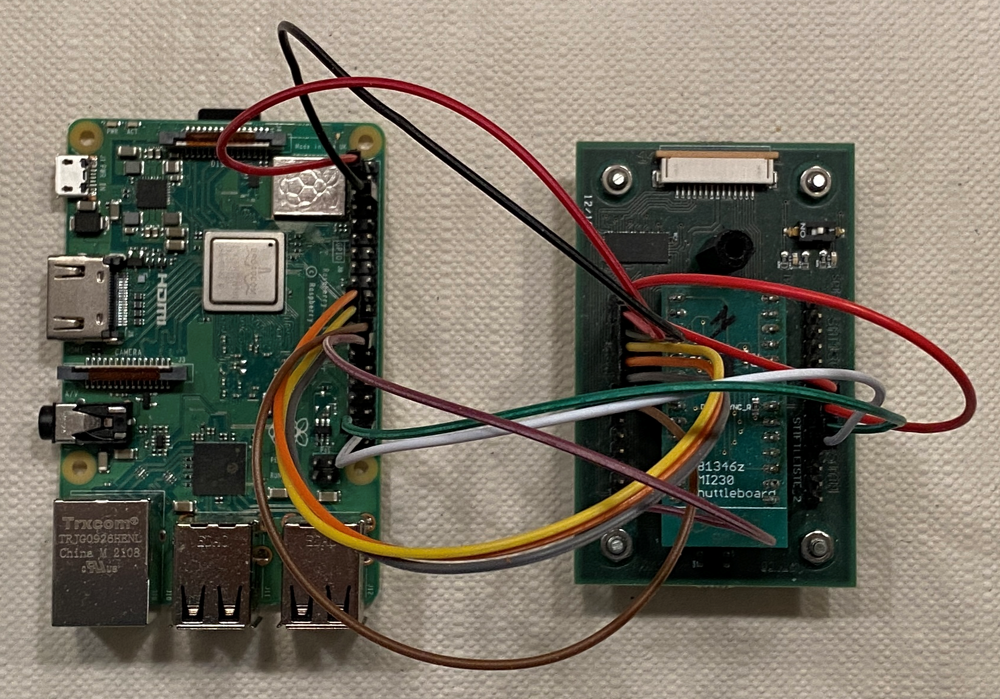
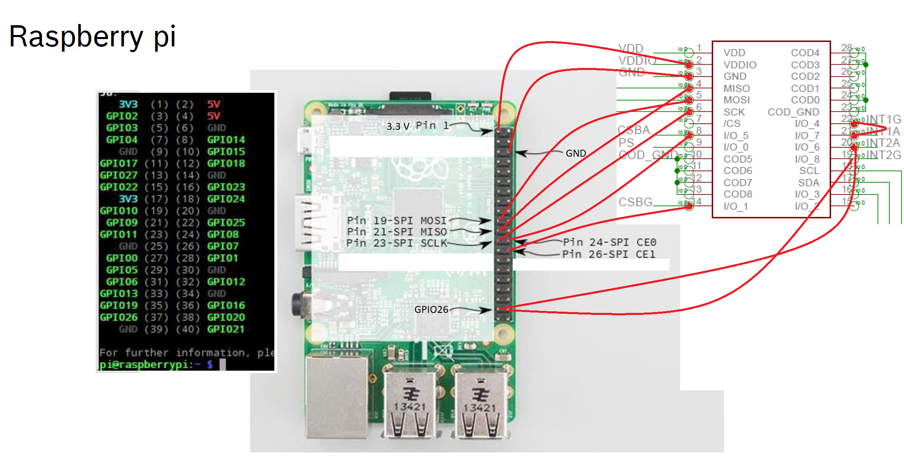

==============================
Bosch SMI230 IIO driver
==============================

1. Overview
===========

The driver is intended to work on Bosch SMI230 Inertial Sensor for Non-Safety Automotive Applications.
The SMI230 is a combined triaxial accelerometer (ACC) and triaxial gyroscope (GYR) for non-safety related applications, e.g. for in-dash navigation in the passenger compartment. Within one package, the SMI230 offers the detection of acceleration and angular rate for the x-, y-, and z-axis. The digital standard serial peripheral interface (SPI) of the SMI230 allows for bi-directional data transmission. To increase flexibility, both gyroscope and accelerometer can be operated individually, but can also be tied together for data synchronization purposes.

2. Hardware Setup
====================

.. important:: This Hardware Setup serves as a quick startup kit, to help the user to run and understand the driver. It is for demonstration purposes, not supposed to be used in a production environment.

2.1 Hardware Components:
-------------------------

#. Raspberry Pi3 ModelB as Linux Host
#. SMI230 sensor + Shuttleboard + Motherboard (acquirable from Bosch)
#. connection cable (female to female)
#. a mini SD card

   
2.2 Cable Connection
----------------------

2.3 First Startup
----------------------

#. Using Raspberry Pi Imager to write Raspberry OS (32 bit) to SD Card
#. Insert SD Card into Raspberry Pi and power on
#. Preferences -> Raspberry Pi configuration -> Interfaces ->enable SSH
#. Switch the Bus selection to SPI on mother board. The green LED shall be on

   
3. Software Setup
====================

3.1 Required Software
----------------------

#. Raspberry Linux kernel (choose kernel branch rpi-5.15.y)  https://github.com/raspberrypi/linux
#. SMI230 IIO Linux driver   https://github.com/boschmemssolutions/SMI230-Linux-Driver-IIO
#. Linux environment (native or as VM) 

.. note:: We do not recommend to build the driver with Linux kernel directly on Raspberry Pi. This takes too long. Build it on PC is much faster. Since the toolchain is Linux based, a Linux environment is required. We use Ubuntu 20.04.1 LTS

- Install Toolchain and dependences  

::

   sudo apt install crossbuild-essential-armhf
   sudo apt install git bc bison flex libssl-dev make libc6-dev libncurses5-dev
   
  
- Clone Respbarry Linux kernel 

::

  git clone --depth=1 --branch <branch_name> https://github.com/raspberrypi/linux

We use kernel v5.15, replace <branch_name> with "rpi-5.15.y"

- Clone SMI230 IIO Linux driver

::
  
  git clone --depth=1  https://github.com/boschmemssolutions/SMI230-Linux-Driver-IIO.git

3.2 Build SMI230 IIO Linux driver
-----------------------------------

Integrate Linux driver into Linux kernel
^^^^^^^^^^^^^^^^^^^^^^^^^^^^^^^^^^^^^^^^^^

- Copy source code into Linux kernel

::

  cp SMI230-Linux-Driver-IIO/drivers/iio/accel/*.c linux/drivers/iio/accel
  cp SMI230-Linux-Driver-IIO/drivers/iio/accel/*.h linux/drivers/iio/accel
  cp SMI230-Linux-Driver-IIO/drivers/iio/gyro/*.c linux/drivers/iio/gyro
  cp SMI230-Linux-Driver-IIO/drivers/iio/gyro/*.h linux/drivers/iio/gyro

- Add entry in accel Kconfig

Open linux/drivers/iio/accel/Kconfig and add the SMI230 entry at bottom

.. code-block:: kconfig

	config IIO_SMI230_ACC
		tristate "Bosch Sensor SMI230 Accelerometer"
		depends on (I2C || SPI_MASTER)
		select IIO_BUFFER
		select IIO_TRIGGERED_BUFFER
		help
		  Build driver for Bosch SMI230 tri-axis accelerometer sensor.

	choice
		prompt "Select communication interface"
		depends on IIO_SMI230_ACC
		help
		  Note: SPI and I2C are not supported at the same time, that is to say:
		  Choose either SPI or I2C to build the driver.

	    config IIO_SMI230_ACC_SPI
			bool "Enable SPI connection"
			depends on SPI_MASTER

	    config IIO_SMI230_ACC_I2C
			bool "Enable I2C connection"
			depends on I2C
	endchoice

	choice
		prompt "Select ACC interrupt source"
		depends on IIO_SMI230_ACC
		default IIO_SMI230_ACC_INT2

	    config IIO_SMI230_ACC_INT1
			bool "use int1 as source"
			help
		 	  This enables INT1 as source for ACC

	    config IIO_SMI230_ACC_INT2
			bool "use int2 as source"
			help
		 	  This enables INT2 as source for ACC
	endchoice

	choice
		prompt "Select ACC interrupt behaviour"
		depends on IIO_SMI230_ACC
		default IIO_SMI230_ACC_PUSH_PULL
	
		config IIO_SMI230_ACC_PUSH_PULL
			bool "push-pull mode"
			help
			  Use push-pull mode for interrupt pin.
		  
		config IIO_SMI230_ACC_OPEN_DRAIN
			bool "open-drain mode"
			help
			  Use open-drain mode for interrupt pin. Pull-up resistor needed!
	endchoice

	choice
		prompt "Select ACC interrupt level"
		depends on IIO_SMI230_ACC
		default IIO_SMI230_ACC_ACTIVE_HIGH
	
		config IIO_SMI230_ACC_ACTIVE_LOW
			bool "active low"
			help
			  Interrupt signal is active low or falling edge.
		  
		config IIO_SMI230_ACC_ACTIVE_HIGH
			bool "active high"
			help
			  Interrupt signal is active high or rising edge.
	endchoice

	config IIO_SMI230_ACC_FIFO
		bool "SMI230 ACC FIFO enable"
		depends on IIO_SMI230_ACC
		help
		 enable ACC FIFO feature.

	choice
		prompt "Select ACC FIFO interrupt type"
		depends on IIO_SMI230_ACC && IIO_SMI230_ACC_FIFO

	    config IIO_SMI230_ACC_FIFO_WM
			bool "use watermark threshold to generate interrupt"

	    config IIO_SMI230_ACC_FIFO_FULL
			bool "generate interrupt when FIFO is full"
	endchoice

	config IIO_SMI230_ACC_MAX_BUFFER_LEN
		depends on IIO_SMI230_ACC
		int "configue read buffer size"
		default "1024"
		help
		  Considering using FIFO, 1024 bytes are big enough for most cases. Do not change this value if not sure.

- Add entry in gyro Kconfig

Open linux/drivers/iio/gyro/Kconfig and add the SMI230 entry at bottom

.. code-block:: kconfig
	
	config SMI230_GYRO
		tristate "BOSCH SMI230 Gyro Sensor"
		depends on (I2C || SPI_MASTER)
		select IIO_BUFFER
		select IIO_TRIGGERED_BUFFER
		help
		  Say yes here to build support for BOSCH SMI230GYRO Tri-axis Gyro Sensor
		  driver connected via I2C or SPI.

	choice
	        prompt "Select communication interface"
	        depends on SMI230_GYRO
	        help
	          Note: SPI and I2C are not supported at the same time, that is to say:
	          Choose either SPI or I2C to build the driver.

	    config SMI230_GYRO_SPI
 	       bool "Enable SPI connection"
 	       depends on SPI_MASTER
	    config SMI230_GYRO_I2C
	        bool "Enable I2C connection"
	        depends on I2C
	endchoice

	choice
	        prompt "Select working mode"
	        depends on SMI230_GYRO

	    config SMI230_GYRO_NEW_DATA
	        bool "New data"
	        help
			interrupt comes once new data is available
	    config SMI230_GYRO_FIFO
 	       bool "FIFO"
	        help
			interrupt comes once data reaches certain FIFO watermark or FIFO full
	endchoice

	choice
		prompt "Select GYRO interrupt source"
		depends on (!SMI230_DATA_SYNC) && SMI230_GYRO
		default SMI230_GYRO_INT4

	    config SMI230_GYRO_INT3
		bool "use int3 as source"

	    config SMI230_GYRO_INT4
		bool "use int4 as source"
	endchoice

	choice
		prompt "Select GYRO interrupt edge"
		depends on (!SMI230_DATA_SYNC) && SMI230_GYRO
		default SMI230_GYRO_INT_ACTIVE_HIGH

	    config SMI230_GYRO_INT_ACTIVE_HIGH
		bool "interrupt is on raising edge"

	    config SMI230_GYRO_INT_ACTIVE_LOW
		bool "interrupt is on falling edge"

	endchoice

	config SMI230_MAX_BUFFER_LEN
	        int "configue read buffer size"
	        default "1024"
	        help
	          Considering using FIFO, 1024 bytes are big enough for most cases. Do not change this value if not sure.	
	
- Add entry in accel Makefile	
	
Open linux/drivers/iio/accel/Makefile and add the SMI230 entry at bottom	
	
.. code-block:: makefile

	obj-$(CONFIG_IIO_SMI230_ACC) += smi230_acc.o
	smi230_acc-objs := smi230_acc_core.o

	ifeq ($(CONFIG_IIO_SMI230_ACC_I2C),y)
		smi230_acc-objs += smi230_acc_i2c.o
	else
		smi230_acc-objs += smi230_acc_spi.o
	endif	
	
- Add entry in gyro Makefile	
	
Open linux/drivers/iio/gyro/Makefile and add the SMI230 entry at bottom	

.. code-block:: makefile

	obj-$(CONFIG_SMI230_GYRO) += smi230_gyro.o
	smi230_gyro-objs := smi230_gyro_core.o
	ifeq ($(CONFIG_SMI230_GYRO_I2C),y)
		smi230_gyro-objs += smi230_gyro_i2c.o
	else        
		smi230_gyro-objs += smi230_gyro_spi.o
	endif

- Change deveice tree overlay	
	
Open linux/arch/arm/boot/dts/overlays/spi-rtc-overlay.dts and change the content as following
	
::

	/dts-v1/;
	/plugin/;

	/ {
		compatible = "brcm,bcm2835";

		fragment@0 {
			target = <&spidev0>;
			__dormant__ {
				status = "disabled";
			};
		};
	
		fragment@1 {
			target = <&spidev1>;
			__dormant__ {
				status = "disabled";
			};
		};
	
		fragment@2 {
			target = <&spi0>;
			__dormant__ {
				#address-cells = <1>;
				#size-cells = <0>;
				status = "okay";
			
				smi230acc@0 {
					compatible = "BOSCH,SMI230ACC";
					spi-max-frequency = <8000000>;
					reg = <0>;
					gpio_irq = <&gpio 26 0>;
				};
			};
		};
	
		fragment@3 {
			target = <&spi0>;
			__dormant__ {
				#address-cells = <1>;
				#size-cells = <0>;
				status = "okay";
			
				smi230gyro@1 {
					compatible = "BOSCH,SMI230GYRO";
					spi-max-frequency = <8000000>;
					reg = <1>;
					gpio_irq = <&gpio 20 0>;
				};
			};
		};

		__overrides__ {
			smi230acc = <0>, "=0=2";
			smi230gyro = <0>, "=1=3";
		};
	};  

Build SMI230 Linux driver with the kernel
^^^^^^^^^^^^^^^^^^^^^^^^^^^^^^^^^^^^^^^^^^^^^^
- Config SMI230 Linux driver

::

  cd linux
  make ARCH=arm CROSS_COMPILE=arm-linux-gnueabihf- bcm2709_defconfig
  make ARCH=arm CROSS_COMPILE=arm-linux-gnueabihf- menuconfig

Activate the option as following

  
.. hint:: To activate an option, press "y" on the option. A \* appears, which means this option is activated as part of the kernel. Alternatively we can press "m" on the option. A "M" appears, which means this option is activated as kernel module (not as part of the kernel). Therefore we need to manually install the kernel module by ourself.

Device Drivers -->	
	<\*>Industrial I/O support  --->
		-\*-     Industrial I/O buffering based on kfifo
		
		-\*-     Industrial I/O triggered buffer support
		
		Accelerometers  --->
			<\*> Bosch Sensor SMI230 Accelerometer
		
		Digital gyroscope sensors  --->
			<\*> BOSCH SMI230 Gyro Sensor
		
	
- Build SMI230 Linux driver	

::

  make -j4 ARCH=arm CROSS_COMPILE=arm-linux-gnueabihf- zImage modules dtbs
	
.. note:: Build process takes quite long on the first time. To reduce the build time, we use the option "-j4". This is the option to enable the build process to be executed parallelly in 4 threads. To improve the parallel execution, just give a big number e.g. "-j6". How many parallel thread to use is dependent on your processor core number.
	

- Install the kernel with SMI230 Linux driver in SD card

insert the SD card (created in 2.3). A "boot" partition and a "rootfs" partition will be mounted. Find out the mount point. In Ubuntu the mount point looks like that

  /media/username/boot
  
  /media/username/rootfs

write the kernel with SMI230 Linux driver in SD card

::

  export KERNEL=kernel7
  export SD_BOOT_PATH=/media/username/boot
  export SD_ROOTFS_PATH=/media/username/rootfs
  sudo env PATH=$PATH make ARCH=arm CROSS_COMPILE=arm-linux-gnueabihf- INSTALL_MOD_PATH=$SD_ROOTFS_PATH modules_install
  sudo cp $SD_BOOT_PATH/$KERNEL.img $SD_BOOT_PATH/$KERNEL-backup.img
  sudo cp arch/arm/boot/zImage $SD_BOOT_PATH/$KERNEL.img
  sudo cp arch/arm/boot/dts/*.dtb $SD_BOOT_PATH
  sudo cp arch/arm/boot/dts/overlays/*.dtb* $SD_BOOT_PATH/overlays/
  sudo cp arch/arm/boot/dts/overlays/README $SD_BOOT_PATH/overlays/

- adapt the boot configuraion

open the "config.txt" in "boot" partition, and add the following entries 

::
	
	# Uncomment some or all of these to enable the optional hardware interfaces
	dtparam=spi=on
	dtoverlay=spi-rtc,smi230acc
	dtoverlay=spi-rtc,smi230gyro

Take the SD card out and put it back in raspberry pi.

4. Work with SMI230 Linux driver
=================================

- Check driver initialization

Power on the raspberry pi. We firstly check if the driver was initialized properly

::

   dmesg | grep SMI230
   [    8.473601] SMI230GYRO spi0.1: Bosch Sensor SMI230GYRO hardware initialized
   [    8.487473] SMI230GYRO spi0.1: Bosch Sensor SMI230GYRO device alloced
   [    8.487783] SMI230GYRO spi0.1: Bosch Sensor SMI230GYRO trigger registered
   [    8.487822] SMI230GYRO spi0.1: Bosch Sensor SMI230GYRO trigger buffer registered
   [    8.487880] SMI230GYRO spi0.1: gpio pin 20
   [    8.488083] SMI230GYRO spi0.1: irq number 201
   [    8.488205] SMI230GYRO spi0.1: Bosch Sensor SMI230GYRO irq alloced
   [    8.492520] Bosch Sensor Device SMI230ACC initialized
   
   
If the driver was installed properly, 2 folders will be created. A number of deveice files are created in the folders. which we can use to read/write data from/to the sensor

   /sys/bus/iio/devices/iio:device0
   
   /sys/bus/iio/devices/iio:device1
   
.. note:: Folder name is assigned automatically by the system, therefore does not reflect the sensor type. There is a "name" file in the deveice folder, which we can read to find out the sensor type

::

	cd /sys/bus/iio/devices/iio:device1
	sudo su
	cat name
	SMI230ACC
	

- Work with driver using command line 

.. note:: To change sensor settings we need root access. It is not sufficient just using "sudo ..."  For the following examples we use accelerometer. Gyroscope is quite similar.

Check sensor type

::

	cd /sys/bus/iio/devices/iio:device1
	sudo su
	cat name
	SMI230ACC
	
check power mode and activate if it is suspended.

::

   cat power_mode
   suspend
   echo normal > power_mode
   cat power_mode
   normal

Read data from sensor. 

::

  cat in_accel_raw
  7797892 78 -94 8160
  cat in_accel_range
  4
  cat in_accel_sampling_frequency
  100.000000
  
Change sensor setting

::

   echo 200 > in_accel_sampling_frequency
   cat in_accel_sampling_frequency
   200.000000
   echo 8 > in_accel_range
   cat in_accel_range
   8
   
- Using driver in C code

SMI 230 Driver provides 2 interfaces for the user space program,

1. Sensor data interface: IIO Buffer. SMI230 driver writes sensor data into the IIO buffer from kernel space. Program from user space reads the data from the IIO buffer
2. Sensor Event interface: IIO Event. SMI230 driver sends IIO Event to user space to inform the program that some sensor event happened. (e.g. sensor value over threshold)

ACC Example to read sensor data:

Source code: be able to find inside the linux source tree    tools/iio/iio_generic_buffer.c

Build the example

::
  
  cd tools
  make ARCH=arm CROSS_COMPILE=arm-linux-gnueabihf- iio
  
Upload iio_generic_buffer in raspberry pi and execute it

.. note:: For the following exsample we use accelerometer. Gyroscope is quite similar. Run iio_generic_buffer as root.  Use device number of SMI230ACC -N 1.  
  
::

  sudo ./iio_generic_buffer -N 1 -c -1 -a
  iio device number being used is 1
  iio trigger number being used is 1
  Enabling all channels
  Enabling: in_accel_y_en
  Enabling: in_accel_x_en
  Enabling: in_timestamp_en
  Enabling: in_accel_z_en
  /sys/bus/iio/devices/iio:device1 SMI230ACC-trigger
  28.000000 -118.000000 8154.000000 1665428973532193471
  41.000000 -102.000000 8181.000000 1665428973542061576
  83.000000 -88.000000 8152.000000 1665428973551912910
  92.000000 -80.000000 8165.000000 1665428973561775285
  87.000000 -90.000000 8173.000000 1665428973571636306
  101.000000 -93.000000 8162.000000 1665428973581498994
  104.000000 -95.000000 8152.000000 1665428973591361369
  89.000000 -106.000000 8163.000000 1665428973601222963
  57.000000 -97.000000 8164.000000 1665428973611084557
  [accX accY accZ time_ns]

.. note:: Check the device number of SMI230ACC by reading "name" from deveice folder

::

	cd /sys/bus/iio/devices/iio:device1
	sudo su
	cat name
	SMI230ACC  

